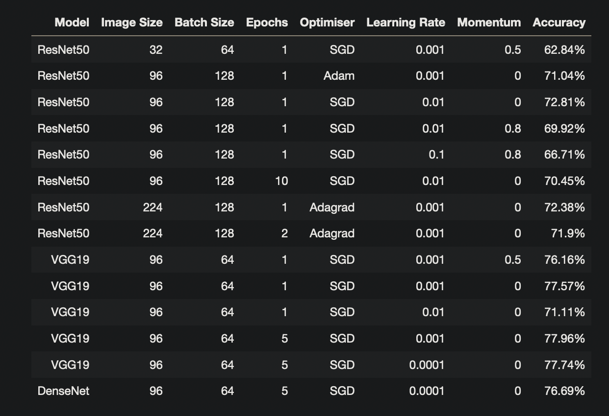
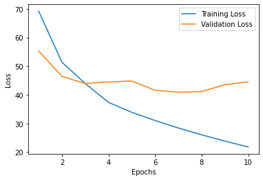
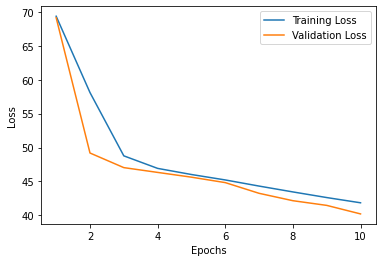
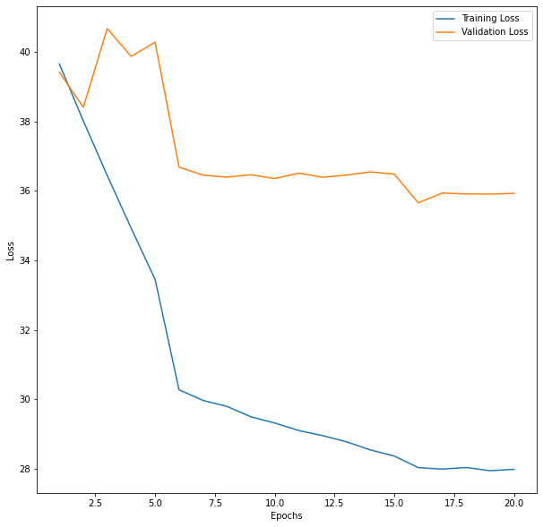
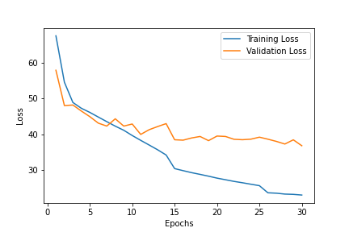

# Introduction

The PatchCamelyon dataset is a set of 327680 colour images of histopathologic scans. These patches are labelled either cancerous, or non-cancerous, based on the presence of metastatic tissue. This project (started in COGS118A at UC San Diego) aims to create deep learning convolutional neural nets to classify these images.

# Initial Tests

Starting with transfer learning, we imported many ImageNet pre-trained models from the PyTorch library. Replacing the last layer with a fully connected layer, we froze all other layers and trained just that singular layer. We tried different image sizes, batch sizes, optimisers, etc. These models yielded a wide variety of results, but none cracked the 80% test accuracy boundary, and seemed to stagnate after 5 or so epochs.

Models such as ResNet50 are optimised for images of size 224x224 or larger, so images from this dataset, of size 96x96 (out of which only a center crop of 32x32 was supposed to be checked) did not perform well on the model. [Geert Litjens](https://geertlitjens.nl/post/getting-started-with-camelyon/), one of the publishers of this dataset, recommends a 6 layer convolutional, 3 layer dense, 2 layer dropout network, as a relatively shallow network equipped with dealing with small images. Following this strategy without using any transfer learning, we started getting relatively high training accuracies, breaking the 80% boundary. The code for this model is provided below this writeup.

After trying over 50 models and parameter combinations over 3 weeks, we started fine tuning our model.

# Fine Tuning

Using this custom-built model, we experimented on a wide number of factors. First of all, we discovered that small batch sizes were preferable to large batch sizes for this model. Although large batches converged to a better minima on the training data, it led to significant overfitting. Following suit with [research](https://arxiv.org/abs/1609.04836) recommending the use of small batch sizes, we decided to use batches of 32-64 images instead of 256-512.

### Model 1

**Stochastic Gradient Descent** _(10 epochs, 5e-3 rate, 0.9 momentum, 0.4 dropout (2 dropout layers), 64 image batch size)_: 83.32% test accuracy

As seen, however, the validation accuracy does not decrease significantly after 3 epochs, indicating a level of overfitting on the training data. Although 83% is a good accuracy, it is likely this won't generalise well with similar pictures from different sets. This model is likely overfit on this dataset's colours, detail, etc. We decided to try more techniques to deal with this.

### Model 2

**Stochastic Gradient Descent** _(10 epochs, 1e-3 rate, 0.9 momentum, 0.3 dropout (3 dropout layers), 64 image batch size, random flips, grayscale)_

**Adaptive Momentum Estimation (Adam)** _(20 epochs, 1e-4 rate, 0.9 momentum, 0.3 dropout (3 dropout layers), 64 image batch size, random flips, grayscale, scheduler (1 patience, 0.1 factor) on validation accuracy)_: 81.89% test accuracy

Here, to deal with the overfitting, I introduced a third dropout layer (between the convolutional layer and the first dense layer), and introduced data augmentation. The first augmentation is random vertical and horizontal flipping of training data, effectively quadrupling the "amount" of training data to reduce overfitting. Secondly, I grayscaled the images to reduce overfitting on colour saturation, since some [experts](https://cs230.stanford.edu/projects_winter_2019/reports/15813329.pdf) claim colour holds no meaning in cancer detection.

I carried out an 10 epochs of SGD followed by 20 epochs of Adam gradient descent, since the Adam optimiser is great at finding a minima regardless of training rate. I also introduced a scheduler at this point to fine tune the model. From this, it is clear to see how the Adam optimiser tends to overfit on training data, which is a known criticism of this optimiser. As such, we realise SGD is the best fit for our model. This test also showed that grayscale doesn't significantly reduce test accuracy, while reducing overfitting (as seen on the first 10 epochs) using SGD.

### Model 3

**Stochastic Gradient Descent** _(30 epochs, 1e-3 rate, 0.92 momentum, 0.35 dropout (3 dropout layers), 32 image batch size, random flips, grayscale, scheduler (2 patience, 0.4 factor) on validation accuracy)_: 84.87% test accuracy

Giving us a fantastic, almost 85% accuracy, this model is incredibly accurate at finding the cancerous examples of patches, while not significantly overfitting on the training data. Trained in about 1 hour on a 1080Ti, this model is both quick to train and accurate to test on unseen data.

# Code

The `Model.ipynb` notebook contains the code for the final version of this program. It requires unzipped data, which can be downloaded from [here](https://github.com/basveeling/pcam). The cell near the bottom allows for parameter modifications.